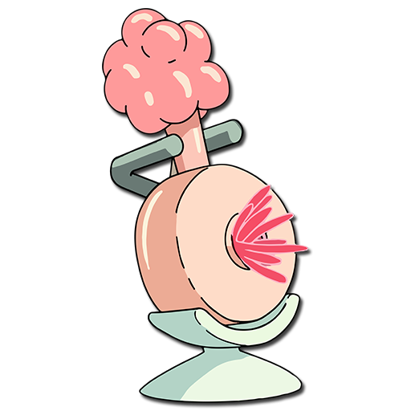

# Purple Durple

***

### ToDo

1. Things we need to get done.
    1. Install Github Desktop on your machine.
    1. Learn how to use Git
1. Commit the files you're working on into this repository.
1. Give me time to review what you're working on and get a functioning environment going to test your code.

***

### Wiki

- [Visit the Wiki!](https://github.com/shortorigin/purpledurple/wiki/)

